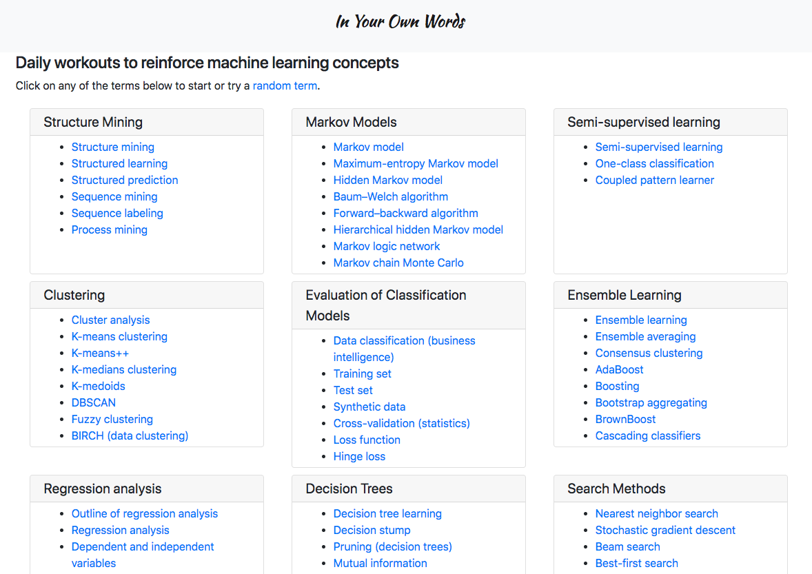
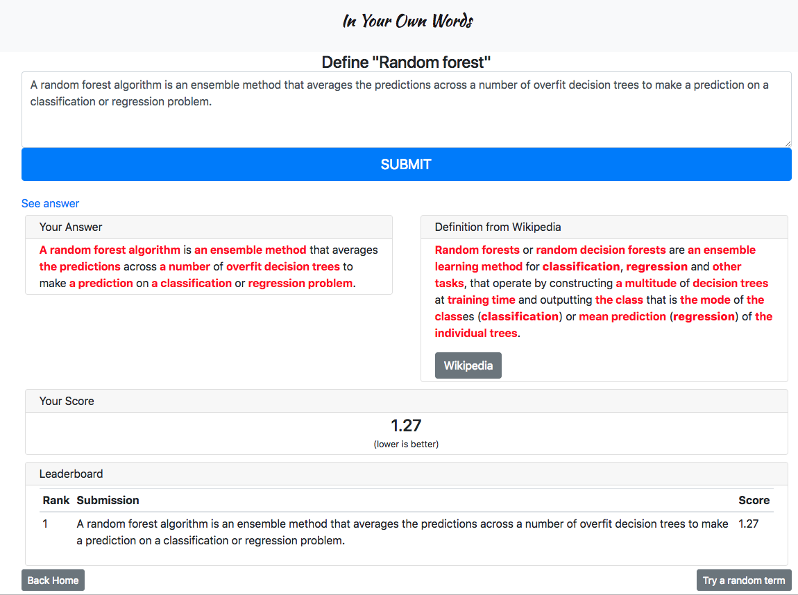

# In Your Own Words
Uses Wikipedia's Machine Learning Book as a resource to quiz and score user's input.
~~Try the out the web app at [http://iyow.xyz](http://iyow.xyz).~~

Try the out by cloning the repo and running `python app.py`

**See dev branch to contribute**





## Contributors
* [Nguyen Ngo](https://www.linkedin.com/in/nguyenmngo/)
* [Ashley Huddleston](https://github.com/huddlestona)

## Project Brief

### Scope/Premise
Uses Wikipedia's Machine Learning Book as a resource to quiz and score user's input.

### Scoring
As an example:
1. Application asks user to define what is precision?
2. User enters their explanation in a text box.
3. Application scores their response using cosine similarity euclidean distance.

### Stack
#### "Scraping"
* requests
* Beautiful Soup

#### NLP
* spaCy

#### Deployment
* Flask
* AWS

### Resources
* [Book:Machine Learning – The Complete Guide - Wikipedia](https://en.wikipedia.org/wiki/Book:Machine_Learning_%E2%80%93_The_Complete_Guide)
* [Rules of Machine Learning:  |  Machine Learning Rules  |  Google Developers](https://developers.google.com/machine-learning/rules-of-ml/)
* [ML Reference](http://mlreference.com/)

### Implementation
To run this website on your computer:

Install spaCy
```
pip install spacy
```

Install the spacy library `en_core_web_lg`
```
python -m spacy download en_core_web_lg
```
Optionally, turn on debug mode for Flask
```
export FLASK_DEBUG=1
```
Run the flask app
```
python src/app.py
```
